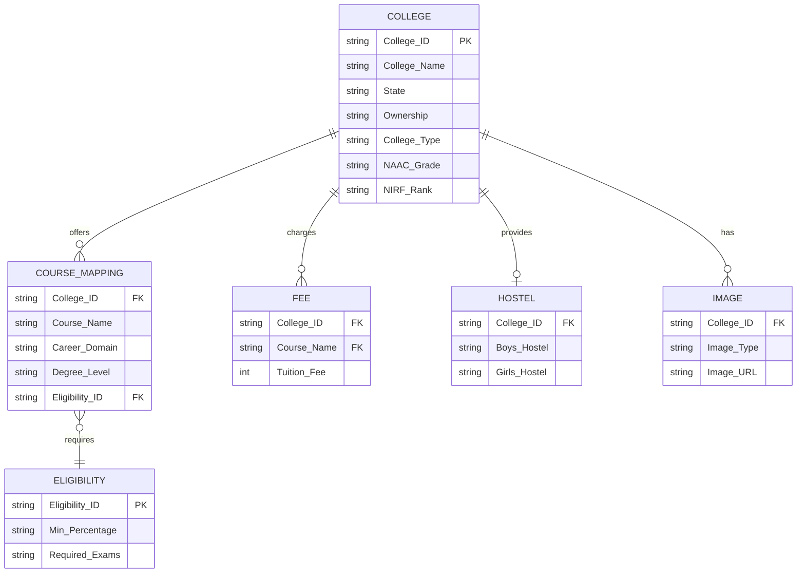

# Dataset Design Report

## File Purpose & Overview
- `college_database.csv`: Contains core metadata for each college, including location, type, ownership, and ranking. Acts as the central entity for the dataset.
- `course_eligibility.csv`: Stores the standard eligibility criteria combinations, including required exams and minimum academic percentages, decoupled from specific courses to avoid duplication.
- `college_course_mapping.csv`: Maps colleges to specific courses they offer, including career domains, degrees, and references to their eligibility criteria.
- `hostel_database.csv`: Details the available hostel facilities (boys/girls), capacities, and base fees per college.
- `fee_database.csv`: Manages the tuition and admission fees for specific courses at specific colleges, separated to allow easy annual updates.
- `image_download_manifest.csv`: Stores URLs of college logos and campus images for bulk downloading, separated from metadata to handle media management independently.

## Normalization Rationale (3NF)
The database is structured following Third Normal Form (3NF) principles to eliminate data redundancy and ensure data integrity.
- **Atomic Values**: Multi-valued attributes like course offerings or facilities are moved to separate tables.
- **Dependency on Primary Key**: All attributes in a table depend entirely on the primary key (e.g., `College_ID` in `college_database.csv`).
- **No Transitive Dependencies**: Fees and eligibility criteria are removed from the core mapping table because they depend on specific profiles or academic years, not just the college-course combination. This prevents duplicating eligibility text across hundreds of identical courses.

## Entity-Relationship Model

## Controlled Vocabulary Choices
Controlled vocabularies strictly restrict values to ensure consistency across the dataset, which is crucial for the ML model's categorical encoding.
- **Ownership**: Government, Private, Deemed, Government-Aided
- **NAAC_Grade**: A++, A+, A, B++, B+, B, C, Unknown
- **NIRF_Rank**: exact integer, "Band 101-150", "Band 151-200", "Band 201-300", "Unranked", "Unknown"
- **AICTE_Approved**: Yes, No, Not Applicable, Unknown
- **Degree_Level**: Undergraduate, Undergraduate Professional, Integrated, Postgraduate
- **Career_Domain**: Standardized domains mapped identically to the ML model's expected inputs (e.g., Engineering, Medical & Health Sciences).

## Design Decisions
- **Dropped Placement_Rating**: Removed because there is no official, verifiable source for uniform placement ratings across all colleges.
- **Separated Fees**: Fees are highly volatile and change yearly. Separating them into `fee_database.csv` allows updating financial data without touching the stable core metadata or course mappings.
- **Decoupled Images**: Moving media links to `image_download_manifest.csv` keeps the primary tables lightweight and handles the asynchronous nature of image scraping and downloading.

## Supporting the Recommendation Engine
This schema allows the Recommendation Engine to perform efficient filtering:
- **Location & Budget**: Joining `COLLEGE` and `FEE` allows filtering by `State` and budget constraints.
- **Academic Stream & Domain**: `COURSE_MAPPING` exposes `Career_Domain` and `Degree_Level` for matching user aspirations.
- **Quality & Facilities**: Users can strictly filter by `NAAC_Grade`, `NIRF_Rank`, `Ownership`, and `Hostel_Available`.

## Scalability Considerations
The relational structure ensures that adding new colleges, courses, or entire states requires no schema changes. New academic years only require updates to the `fee_database.csv`.
