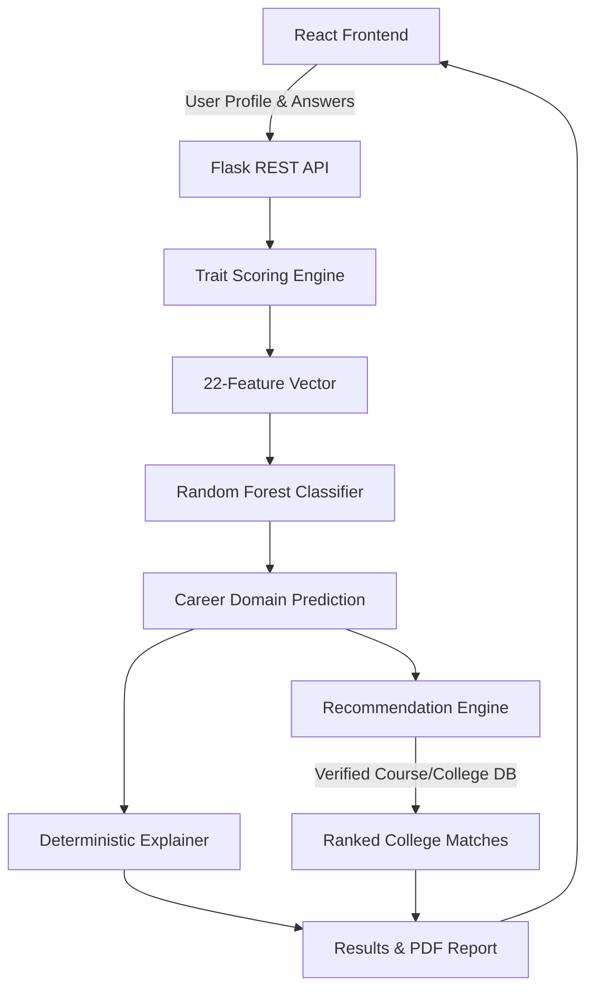

# ALTIORA

ALTIORA is an assessment-based personalized career guidance system that combines academic information, a questionnaire-based assessment, Random Forest career-domain prediction, deterministic explainability, course recommendation, and verified college matching.

## Overview

Choosing a career path based solely on academic marks can be misleading, as marks may not fully represent a student's aptitude, interests, or soft skills. ALTIORA addresses this problem by integrating a student's academic history with a comprehensive personality and aptitude assessment. The system evaluates academic inputs alongside psychological traits to predict suitable career domains. Its primary purpose is to offer holistic, data-driven, and explainable career guidance that aligns with both a student's capabilities and verified educational pathways.

## Key Features

- **138-Question Assessment:** Categorized into Scenario, Preference, Behaviour, and Aptitude questions.
- **8 Assessment Traits:** Evaluates Logical Score, Analytical Score, Technical Interest, Business Interest, Creativity Score, Communication Score, Leadership Score, and Research Interest.
- **22-Feature Prediction Input:** Combining academic marks, percentages, and the 8 calculated assessment traits.
- **Random Forest Prediction:** Classifies student profiles into one of 10 broad career domains.
- **Deterministic Explainability:** Generates a reasoning narrative based on actual academic and assessment evidence, without relying on opaque ML explainers.
- **Course Recommendation:** Recommends specific courses related to the predicted career domains.
- **College Matching:** Ranks and recommends colleges based on verified course availability, location, and student preferences.
- **Full-Stack Application:** Includes a React frontend and a Flask backend REST API.
- **Career Report:** Provides a downloadable PDF career report.

## System Workflow

Student Profile
→ Academic Information
→ Assessment
→ Trait Scoring
→ 22-Feature Vector
→ Random Forest
→ Career Domain Prediction
→ Explanation
→ Course Recommendation
→ College Matching
→ Results

## Architecture



## Assessment

The system features a structured **138-question** assessment comprising:
- **Categories:** Scenario, Preference, Behaviour, Aptitude.
- **8 Traits Evaluated:**
  - `Logical_Score`
  - `Analytical_Score`
  - `Technical_Interest`
  - `Business_Interest`
  - `Creativity_Score`
  - `Communication_Score`
  - `Leadership_Score`
  - `Research_Interest`

## Machine Learning

The initial ML formulation attempted fine-grained classification across 113 specific courses. However, due to feature overlap among similar courses (e.g., various B.Tech specializations), the final system utilizes a broader **10 career domains** approach to ensure robust and meaningful predictions.

- **Model:** Random Forest Classifier
- **Target:** 10 Career Domains
- **Features:** 22 final prediction features

**Performance Metrics:**
- **Accuracy:** ≈ 62.97%
- **Cross-validation:** ≈ 63.35% ± 0.35 percentage points
- **Macro F1:** ≈ 0.5947
- **Balanced Accuracy:** ≈ 61.10%
- **Weighted F1:** ≈ 61.36%
- **Top-3 Accuracy:** ≈ 94.78%

## Explainability

ALTIORA emphasizes transparent recommendations using a **deterministic explanation system**. 
It does NOT use black-box explainers like SHAP or LIME. Instead, the system evaluates the student's highest assessment traits and academic strengths to programmatically generate a clear, narrative-based reasoning summary explaining why a particular career domain was predicted.

## Recommendation System

1. **Career-Domain Prediction:** The ML model predicts the most suitable broad career domain.
2. **Course Recommendation:** The system maps the predicted domain to specific relevant courses.
3. **Course Scoring:** Dimensions like location, budget, and ownership match are weighted and normalized (0-100) to rank options.
4. **College Matching:** College recommendations are not ML predictions; they are database-driven matches. The system ranks verified colleges based on the student's preferences and actual course availability.

## Technology Stack

- **Backend:** Python, Flask
- **Machine Learning:** scikit-learn, pandas, NumPy
- **Frontend:** React, JavaScript (Vite, Tailwind CSS, Framer Motion)
- **Reporting:** jsPDF

## Project Structure

```text
ALTIORA/
├── College Datasets/
├── artifacts/
├── encoders/
├── frontend/
│   ├── public/
│   ├── src/
│   ├── index.html
│   ├── package.json
│   └── vite.config.js
├── models/
├── reports/
├── tests/
├── app.py
├── config.py
├── course_domain_mapping.xlsx
├── course_mapping.py
├── evaluate.py
├── predict.py
├── preprocessing.py
├── questionnaire.py
├── questions.json
├── recommend.py
├── recommendation_engine.py
├── requirements.txt
├── run_experiments.py
├── student_career_synthetic_expanded_86000.xlsx
├── student_career_with_domains.xlsx
├── subject_combination_mapper.py
├── train_domain_model.py
└── train_model.py
```

## Getting Started

### Prerequisites
- Python 3.9+
- Node.js (for Vite and React frontend)

### Backend Setup
```bash
python -m venv venv
# On Windows
venv\Scripts\activate
# On macOS/Linux
# source venv/bin/activate

pip install -r requirements.txt
```

### Frontend Setup
```bash
cd frontend
npm install
```

### Running the Application

**Backend:**
```bash
python app.py
```
*(By default, Flask runs on `http://127.0.0.1:5000`)*

**Frontend:**
```bash
cd frontend
npm run dev
```

### API
Key available endpoints include:
- `GET /`
- `GET /health`
- `GET /questions`
- `GET /assessment`
- `POST /predict`

## Machine Learning Model Files

**IMPORTANT:**
Two trained model files are intentionally **NOT** stored in this GitHub repository because they exceed GitHub's 100 MB per-file limit:
- `models/career_model_tuned.pkl` (≈ 556.32 MB)
- `models/domain_model.pkl` (≈ 112.06 MB)

A complete local deployment requires these model files to be obtained from the original development environment or project storage and placed inside the `models/` directory.

## Dataset

- **Size:** 86,000 records
- **Initial State:** 26 original attributes and 113 original course labels
- **Final Formulation:** Mapped to 10 broad career domains
- **Features:** 22 final prediction features
- **Data Split:** 80:20 stratified split (68,800 training records, 17,200 testing records)

## Results

| Metric | Value |
|--------|-------|
| Test Accuracy | 62.97% |
| Cross-Validation (Mean) | 63.35% |
| Macro F1 | 0.5947 |
| Weighted F1 | 0.6136 |
| Top-3 Accuracy | 94.78% |

*The model performs exceptionally well at identifying suitable domains within its top-3 predictions (94.78%).*

## Limitations

- Large trained model files cannot be stored in GitHub and must be managed separately.
- The dataset is synthetically generated, which may exhibit artifact patterns different from real-world student data.
- College matching heavily depends on the completeness of the available verified datasets.
- The system provides data-driven career guidance and suggestions rather than guaranteed career outcomes.

## Future Scope

- **Integration of Explainable AI (XAI):** Potential future implementation of SHAP or LIME for deeper feature importance analysis.
- **Hierarchical Classification:** Exploring a two-step classification (course family → specific specialization) to improve accuracy.
- **Real-World Validation:** Transitioning from synthetic data to collecting and validating against real-world student data.
- **Richer College Matching:** Expanding the verified dataset for broader and more precise location-based college matching.

## Academic Context

ALTIORA was developed as a final-year academic BCA project demonstrating the practical integration of full-stack web development, machine learning, and deterministic explainability.

## License

No license is currently specified.

## Security / Repository Hygiene

To maintain repository hygiene and security, the following are intentionally excluded from version control:
- Environment variables and secret files (`.env`)
- Node modules (`node_modules/`)
- Python virtual environments (`venv/`)
- System caches and generated build artifacts (`__pycache__/`, `audit_output/`, etc.)
- Oversized machine learning model files
